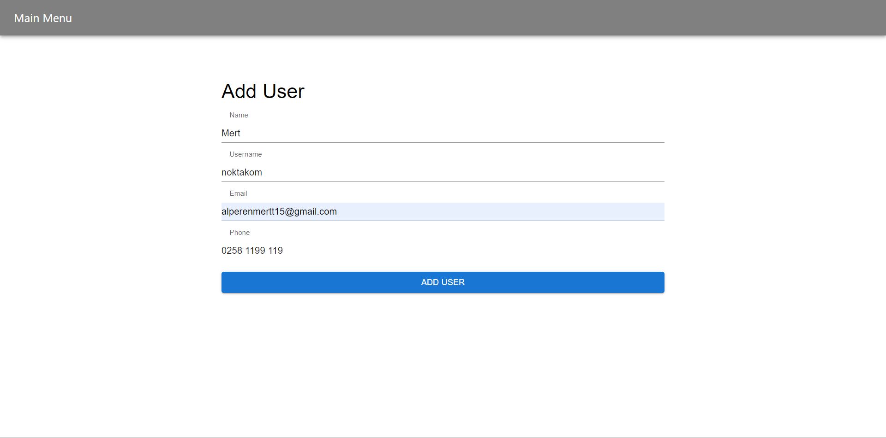
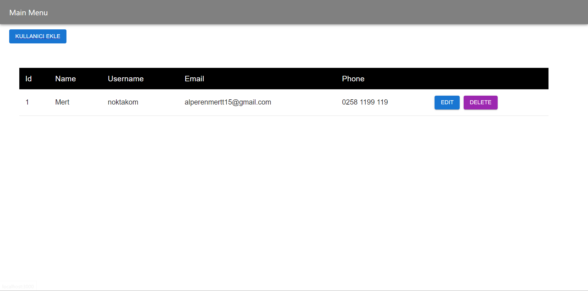
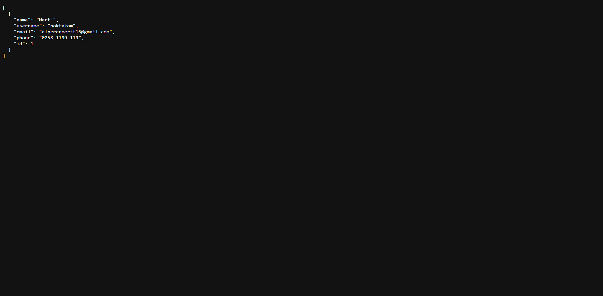

# Contact Manager

## Screenshots

## How to Use
npm start and npm run json-server

### `npm start`

Runs the app in the development mode.\
Open [http://localhost:3000](http://localhost:3000) to view it in your browser.

The page will reload when you make changes.\
You may also see any lint errors in the console.

### `npm run json-server`

http://127.0.0.1:3002/users our APİ source.

## Learn More

You can learn more in the [Linkedln Profile](https://www.linkedin.com/in/mert-urdoğan-5b3284204/).

